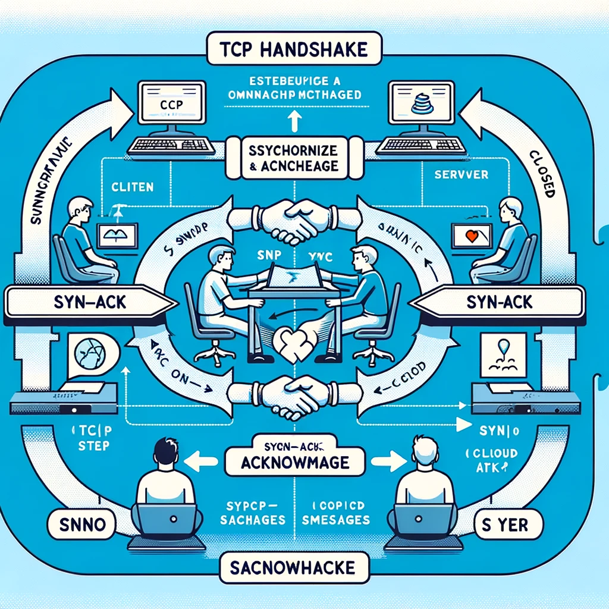
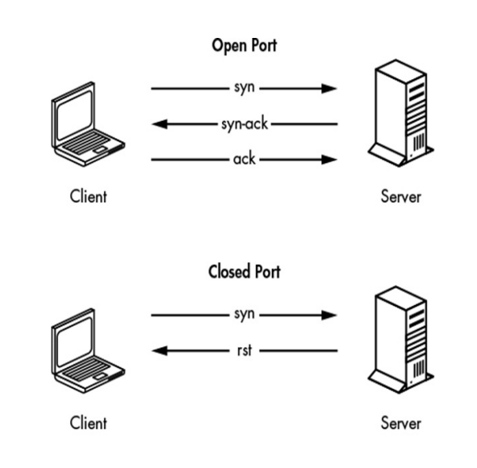

# Capitulo 2

Comencemos nuestra aplicación práctica de Go con el Protocolo de Control de Transmisión (TCP), el estándar predominante para comunicaciones confiables y orientadas a la conexión y la base de la red moderna. TCP está en todas partes y cuenta con bibliotecas bien documentadas, ejemplos de código y flujos de paquetes generalmente fáciles de entender. Debes comprender TCP para evaluar, analizar, consultar y manipular el tráfico de red completamente. Como atacante, deberías entender cómo funciona TCP y ser capaz de desarrollar construcciones TCP utilizables para que puedas identificar puertos abiertos/cerrados, reconocer resultados potencialmente erróneos como falsos positivos—por ejemplo, protecciones contra inundación syn—y sortear restricciones de egreso a través del reenvío de puertos. En este capítulo, aprenderás comunicaciones básicas TCP en Go; construirás un escáner de puertos concurrente y adecuadamente regulado; crearás un proxy TCP que puede ser utilizado para el reenvío de puertos; y recrearás la característica de "agujero de seguridad" de Netcat.
Se han escrito textos completos para discutir cada matiz de TCP, incluyendo la estructura y flujo de paquetes, fiabilidad, reensamblaje de comunicaciones y más. Este nivel de detalle está más allá del alcance de este libro. Para más detalles, deberías leer "The TCP/IP Guide" de Charles M. Kozierok (No Starch Press, 2005).

## COMPRENDIENDO EL HANDSHAKE TCP

Para aquellos que necesitan un repaso, revisemos los conceptos básicos. La figura 2-1 muestra cómo TCP utiliza un proceso de handshake al consultar un puerto para determinar si el puerto está abierto, cerrado o filtrado.

Voy a crear una imagen que ilustre el proceso de handshake TCP, donde un cliente y un servidor realizan el intercambio de mensajes para establecer una conexión. Este proceso incluirá los pasos de SYN (sincronización), SYN-ACK (sincronización y acuse de recibo), y ACK (acuse de recibo), que son esenciales para determinar el estado de un puerto durante una consulta TCP.

